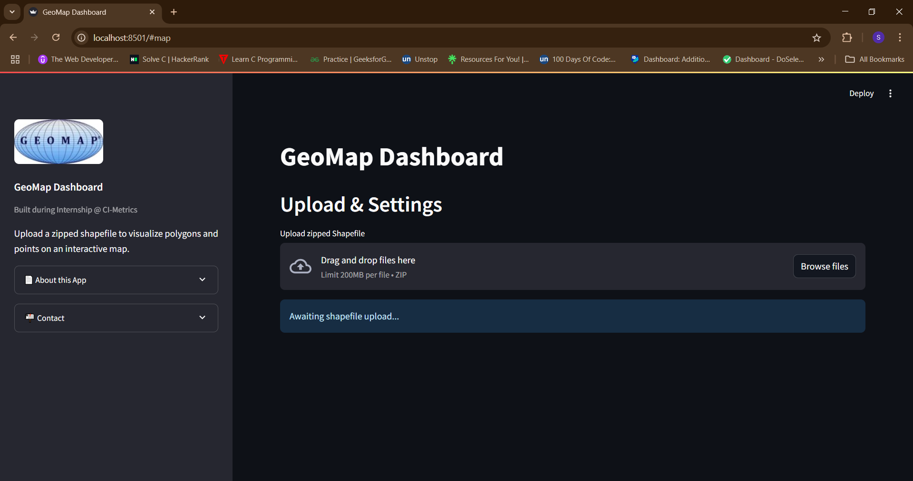
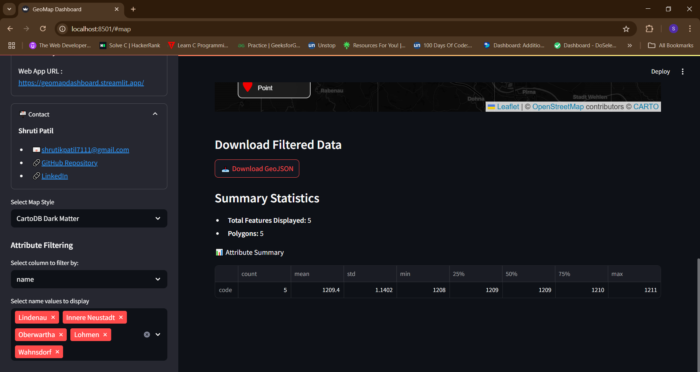

# GeoMapDashboard

**GeoMap Dashboard** is an interactive web application built with **Streamlit** that enables users to upload zipped shapefiles and visualize geospatial polygon and point data on an interactive map.

This dashboard was developed as part of a 21-week internship at [CI Metrics](https://www.ci-metrics.com), and is designed to support data exploration, filtering, and exporting of spatial datasets.

🌐 **Live App:** [https://geomapdashboard.streamlit.app](https://geomapdashboard.streamlit.app/)

---

## 🗺️ Features

- ✅ Upload zipped Shapefiles (ZIP containing `.shp`, `.dbf`, `.shx`, etc.)
- ✅ Visualize polygons and points on an interactive **Folium** map
- ✅ **Map style switcher** with:
  - OpenStreetMap
  - CartoDB Positron
  - CartoDB Dark Matter
  - Stamen Terrain
  - Stamen Toner
- ✅ Filter by attribute:
  - Categorical (via multiselect)
  - Numeric (via range slider)
- ✅ Auto-zoom to selected features
- ✅ View attribute table alongside the map
- ✅ Export filtered data as **GeoJSON**
- ✅ Display basic **summary statistics** and geometry types
- ✅ Custom **legend box** and hover-styled buttons
- ✅ Sidebar sections:
  - ℹ️ About the App
  - 📬 Contact details and links

---

## 🖼️ Dashboard Preview

---

## 🛠️ Tech Stack

| Component      | Tool/Library           |
|----------------|------------------------|
| Web Framework  | Streamlit              |
| Geospatial     | GeoPandas              |
| Mapping        | Folium + Leaflet.js    |
| Frontend       | HTML (via Streamlit), Custom CSS |
| Data Handling  | Pandas                 |
| Deployment     | Streamlit Cloud        |

---

## 📁 Folder Structure
├── app.py                  # Main application logic  
├── images/                  # Dashboard previews  
├── .devcontainer/          # Dev container setup for GitHub Codespaces / VS Code  
   └── devcontainer.json   # Dev container config file 
├── requirements.txt        # Python dependencies  
└── README.md               # Project overview and instructions

---

## 👩‍💻 Developer Info  
**Shruti Patil**  
- 📧 shrutikpatil7111@gmail.com  
- 🔗 [GitHub Repository](https://github.com/ShrutiPatil7111/GeoMapDashboard)  
- 🔗 [LinkedIn](https://www.linkedin.com/in/shrutipatil71/)

---

## 📌 Acknowledgments  
- Built using [Streamlit](https://streamlit.io/)  
- Mapping via [Folium](https://python-visualization.github.io/folium/)  
- Geospatial analysis via [GeoPandas](https://geopandas.org/)

---

## 💻 Development Environment

This project supports **GitHub Codespaces** and **VS Code Dev Containers** for easy setup.

To get started:

- Click the ✏️ **pencil icon** at the top-right of the GitHub repo to launch **Codespaces**.
- Or use **VS Code** with the *Remote - Containers* extension to open this project locally in a container.

The development environment will:
- Automatically install all required Python packages from `requirements.txt`
- Run the Streamlit app inside the container on port `8501`

> ✅ Dev container config is located in `.devcontainer/devcontainer.json`

---

## 💡 Future Enhancements (Optional Ideas)  
- Add heatmap and clustering options  
- Enable uploading multiple shapefiles  
- Time-based filtering or animation for temporal data  
- OAuth for saving/exporting to cloud storage

---

## ✅ Security Audit

This application was tested with [Bandit](https://bandit.readthedocs.io/) for Python code security issues.  
**Scan Result:** No issues identified (High, Medium, or Low severity) as of May 31, 2025.

